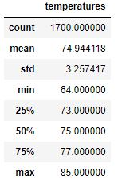
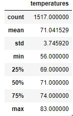

# surfs_up
## Overview
In this analysis I looked at weather data to determine weather trends in Hawaii. I looked specifically at the months June and December to see if a surf and ice cream shop combination was reasonable year around in Hawaii. 

## Results

| June Temps | December Temps |
| :----------: | :--------------: |
| |  | 

- Although Hawaii's temperatures don't fluxuate as much as other states might, the mean temperature in June was almost 75 degrees, while in December it was 71 degrees.
- The minimum temperature in June was significantly higher in June at 64 degrees, while the minimum in December was 56 degrees.
- The max temperature did not vary that much with the max being 85 in June, and 83 in December. 

## Summary 
While there is some variation in the weather from June and December, the changes are relatively small. From looking at the minimum, maximum, and mean temperatures from the months, I think it would be warm enough to run a surf and ice cream shop year round. 

One other query I would run to gather information is on the number of days with precipitation in each of the months. It would be important to determine if it rains significantly more often in the winter than in the summer. 

Another analysis I might run is looking at average temperatures and precipitation from June and December over the years to see if there has been a lot of variation, or if the averages tend to be similar year over year. 